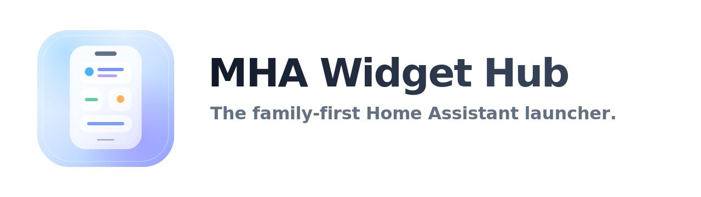

<p align="center">
  
</p>

# MHA Widget Hub

> **The family-first Home Assistant launcher.**

MHA Widget Hub is an experimental custom Home Assistant launcher/dashboard project focused on a premium, spatial, widget-based interface for family homes.

The current project already includes a visual shell, responsive grid system, edit mode, widget placement tools, a widget manager MVP, theme styles, and reusable UI components. It is **not yet explicitly connected to Home Assistant entities/services** in this prototype stage. The foundation is being built first: interface, layout, interaction model, and design system.

## Summary

MHA Widget Hub aims to make Home Assistant feel less like a technical dashboard and more like a polished home launcher.

Instead of thinking in cards stacked in a dashboard, MHA thinks in widgets placed on a spatial grid. The user can enter edit mode, choose widgets from a manager, see valid ghost placement slots, and build a layout visually. The long-term goal is simple: a clean interface for the family, with enough power behind it for the person managing the smart home.

## Project status

Current state: **visual/interaction prototype with working layout systems**.

Present today:

- custom shell and launcher-style UI;
- responsive widget grid for mobile, tablet, and desktop;
- edit mode;
- widget move mode with arrow-based movement;
- ghost drop slots for valid placement;
- widget manager MVP;
- placeholder widgets and slider widgets;
- visual themes: OneUI, iOS-inspired, and Material-inspired;
- accent palettes and icon shape options;
- screensaver UI;
- floating controls;
- mobile portrait/landscape behavior rules;
- reusable UI primitives such as sliders, toggles, buttons, icons, and pills.

Not present yet:

- explicit Home Assistant entity binding;
- service calls;
- real widget configuration flow;
- production-ready HACS packaging;
- multi-user/family permissions;
- polished documentation for installation inside Home Assistant.

## Why “launcher”?

MHA Widget Hub is designed around the idea that a smart home interface should feel like the home screen of the house.

A launcher is not just a page of cards. It is a place where the most important controls live, where layout matters, and where visual hierarchy helps everyone understand what to touch.

MHA uses that model for Home Assistant:

- widgets are placed spatially;
- available positions are shown visually;
- the grid prevents invalid placement;
- editing is intentional and separated from everyday use;
- the normal interface stays clean for non-technical users.

## Design goals

### Family-first

The everyday interface should be obvious, calm, and touch-friendly. The goal is not to expose every entity at once. The goal is to make the right controls easy to find.

### Power-user managed

The advanced user can design the layout, tune widgets, choose styles, and eventually bind entities. The rest of the household should not need to understand the machinery underneath.

### Spatial editing

MHA avoids freeform chaos. Widget placement is guided by the grid. When adding or moving a widget, the interface shows valid ghost slots so the user chooses from legal positions instead of fighting collisions.

### Premium visual language

The interface is inspired by modern mobile operating systems: soft surfaces, clear typography, blurred floating controls, adaptive themes, and launcher-like interaction patterns.

## Core interaction model

The current editor is built around three main concepts:

### Add

Enter edit mode, tap the `+` button, choose a category, choose a widget variant, then pick a ghost slot on the grid.

### Move

Use the widget move button to enter move mode. From there, widgets can be moved with directional arrows and smart swap logic.

### Place

Ghost slots show only valid positions for the selected widget size. This keeps the layout legal and predictable.

Free browser drag-and-drop has intentionally been removed. The official movement model is now slot-based placement and arrow-based movement.

## Current widget manager MVP

The widget manager currently includes common starter categories:

- Weather;
- Lights;
- Climate;
- Media;
- Security;
- System.

These categories include placeholder widgets and slider widgets in useful sizes. They are meant to validate the complete flow before real Home Assistant configuration is added.

## Responsive behavior

MHA currently treats layouts differently depending on screen class:

### Desktop and tablet

- non-scroll-first launcher surface;
- larger grid;
- editing tools available;
- widget manager opens as a wider settings-style panel.

### Mobile portrait

- scrollable launcher;
- floating controls;
- edit mode available;
- widget manager uses mobile sheet dimensions;
- categories appear as a single-column list.

### Mobile landscape

- edit mode disabled;
- widget manager hidden;
- floating edit/add controls hidden.

## Themes

MHA currently includes three visual style directions:

### OneUI

Soft, warm, rounded, translucent, and family-friendly.

### iOS-inspired

Glassier and more reflective, with an emphasis on soft depth.

### Material-inspired

Tonal containers, flatter elevation, and Material-like structure.

Each style supports accent color choices and icon shape preferences.

## Repository structure

The project is intentionally modular:

```text
mha-control-hub.js              Main custom element / shell orchestration
src/
  components/                   Icon primitives
  core/                         Storage helpers
  icons/                        Icon symbol catalog
  layout/                       Shell, dock, status bar, layout engine
  screensaver/                  Screensaver UI
  settings/                     Settings panel and accent palettes
  ui/                           Reusable UI controls
  widget-manager/               Widget Manager MVP
  widgets/                      Widget renderers and widget layout helpers
styles/
  components/                   UI primitive styles
  core/                         Tokens and background
  layout/                       Shell/grid/dock/floating controls/status bar
  screensaver/                  Screensaver styles
  settings/                     Settings panel styles
  themes/                       OneUI/iOS/Material theme styles
  widget-manager/               Widget Manager styles
  widgets/                      Widget styles
assets/
  brand/                        Logo and icon assets
```

## Development notes

This project is currently moving fast and prioritizes the foundation of the product:

1. visual shell;
2. responsive grid;
3. editor model;
4. widget manager;
5. theme system;
6. then Home Assistant binding.

The intent is to avoid prematurely wiring Home Assistant entities before the interface model is strong enough.

## Roadmap

Likely next steps:

- real widget configuration flow;
- Home Assistant entity selectors;
- service-call bindings;
- weather/media/light/climate widget implementations;
- layout import/export;
- multi-page launcher support;
- HACS-ready packaging;
- documentation for installation and usage;
- app/webview launcher strategy for family devices.

## Name

**MHA Widget Hub** means a widget-first hub for managing the smart home experience.

The product idea is simple:

> Made for the family, managed by the power-user.

## License

License not selected yet.


## Accent swatch selected checkmarks

Accent swatches now use the same internal check mark selected state across iOS,
OneUI and Material. External contour/ring highlights were removed to keep the
selection treatment clean and compatible with squircle masking.


## First launch defaults

On a fresh browser/device with no saved preferences, MHA Widget Hub opens with:

- theme: Auto;
- visual style: OneUI;
- accent: first OneUI blue;
- icon shape: Auto;
- screensaver: enabled;
- screensaver delay: 30 seconds;
- Now Bar: enabled;
- clock: digital.

These are only fallback values. Once the user changes a setting, the saved
localStorage preference remains persistent and is not overwritten by the defaults.


## Theme Auto first-launch fix

The theme setting now defaults to `Auto` on first launch. Persisted user choices
from localStorage still win, but document-level effective theme bootstrap values
are no longer allowed to make a fresh install appear as `Sombre`.


## Widget Manager settings token parity

The Widget Manager now follows the Settings panel visual contract more closely:
same sheet class, same surface tokens, and category/widget tiles styled like
settings sections across iOS, OneUI, and Material.


## Status bar safe frame alignment

The experimental centered-shell content frame was rolled back. Tablet/desktop
status bar alignment now uses a safer CSS-only frame: the shell and grid math
remain untouched, while the status bar and floating edit button use the same
left/right page padding inset.


## Status bar padding compensation

Tablet/desktop status bar alignment now compensates for the existing horizontal
padding inside `.mha-widget-area` and `.mha-grid` instead of removing that
padding. The internal grid padding remains intact, while the status bar left
inset is adjusted so the visual widget edge aligns with the right-side frame.


## Grid frame left nudge

After status bar alignment, tablet/desktop grid placement received a very small
left nudge. This does not change grid math, widget positions, or internal
padding; it only optically aligns the visible widget frame.


## Grid vertical nudge rollback

The previous vertical grid compensation was too aggressive and made the widget
grid sit too high. The grid is restored to the earlier horizontal-only nudge,
while the status bar shadow remains removed.


## Material You slider shape #1

Material sliders now follow the reference #1 shape: accent active track, pale
inactive track, vertical handle, and a small stop indicator dot. All colors are
driven by `--mha-accent` and Material surface tokens; iOS and OneUI sliders are
unchanged.


## Status bar theme token surfaces

The status bar now follows the active visual style tokens without changing its
geometry: iOS uses a liquid glass surface, OneUI uses a soft widget-aligned
surface, and Material uses tonal container surfaces. The status bar remains
shadowless.


## iOS Control Center SliderWidget

Full SliderWidget instances now use an iOS Control Center-style treatment when
the visual style is iOS. The widget itself becomes the slider surface and fill,
while the reusable slider component remains unchanged for embedded sliders and
for OneUI/Material.


## iOS SliderWidget fill fix

The iOS Control Center-style SliderWidget now receives `--mha-slider-value` on
the widget shell itself, so the active/inactive regions are visible. The hidden
native input also covers the full widget surface instead of appearing as a small
centered control.


## iOS SliderWidget active fill layer

The iOS Control Center-style SliderWidget now draws its active fill on the
internal widget grid layer, below the invisible full-surface input. The inactive
surface follows `--mha-widget-surface`, while the active region follows
`--mha-accent`.


## iOS SliderWidget white fill and pointer fix

The iOS Control Center-style SliderWidget active region now uses translucent
iOS white instead of the accent color. Full-surface pointer handling was added
for iOS SliderWidget instances so dragging/clicking works across the widget and
vertical sliders increase upward/decrease downward.


## iOS SliderWidget drag direction fix

The iOS Control Center-style SliderWidget now uses custom full-surface pointer
mapping. Dragging works across the whole widget, and vertical sliders map bottom
to min / top to max. The native mobile vertical slider handler is skipped for
this iOS full-widget treatment to avoid inverted behavior.


## iOS SliderWidget inactive soft gray

The inactive region of the iOS Control Center-style SliderWidget now uses a
subtle iOS gray glass surface that is more transparent than the active white
fill. This improves the active/inactive distinction without making the inactive
surface feel dark.


## iOS SliderWidget inactive widget surface

The inactive region of the iOS Control Center-style SliderWidget now uses the
exact widget surface token, `--mha-widget-surface`, instead of a separate gray
overlay. The active region remains translucent white, and the glass sheen was
reduced so the inactive area matches regular widgets.


## Screensaver edit hotspot

In screensaver mode, the primary edit/settings entry point is intentionally
invisible but remains clickable as a larger top-left hotspot. This keeps the
screensaver clean while avoiding unreliable long-press gestures on mobile
WebViews.


## Screensaver real settings hotspot

The invisible screensaver settings hotspot now targets the real screensaver
settings button instead of the main dashboard edit button. The hotspot is moved
to the top-left and enlarged, while the dashboard edit/+ controls remain hidden
and non-interactive during screensaver mode.


## Clock widget variants

A 2×2 Clock Widget is available in the Widget Manager under Utilitaires with four
variants: digital, analog, iOS analog, and scientific. The screensaver reuses the
same clock variants without a widget tile background so its lockscreen-style
presentation stays clean.


## Clock widget persistence fix

Clock widgets created from the Widget Manager now persist as `kind: "clock"`
custom widgets instead of falling back to empty widgets. The renderer also
recognizes earlier utility clock entries by category/variant, so previously
created clock entries can render correctly after refresh.


## Clock widget persistence fix 3

Widget persistence no longer depends on the legacy auto-pack layout validator.
Explicit ghost-slot placement is already validated before saving, so
`_saveWidgets()` now writes the current widget contract/order/sizes directly.
This prevents multiple 2×2 ClockWidgets from appearing temporarily but
disappearing after browser refresh.


## Clock widget persistence fix 4

The legacy auto-pack validator is no longer used as a global save gate. It is
kept only as a fallback/resize heuristic, while widget persistence now follows
the explicit ghost-slot position map. This prevents valid multi-clock layouts
from disappearing after refresh.


## OneUI flatter floating buttons

The OneUI main edit button and mobile floating dock button now share the same
blurred surface treatment. Their shadows were reduced for a flatter, cleaner
look while keeping the OneUI glass/blur identity.


## System button tokens

Floating shell controls now share `--mha-system-button-*` tokens. The edit/add
buttons and the mobile dock launcher consume the same background, border,
shadow, blur, and highlight tokens. OneUI defines a flatter blurred treatment,
and `mobile-dock.css` now explicitly respects those tokens so the dock launcher
matches the edit button.


## System button tokens for iOS and Material

iOS and Material now define their own `--mha-system-button-*` tokens. iOS keeps
the Liquid Glass-style blurred/translucent controls, while Material uses flatter
tonal container surfaces with minimal shadow and no glass blur. The existing
shared consumers remain unchanged.


## Semantic tokens phase 1

A new role-based token layer was added in `styles/themes/semantic-tokens.css`.
It introduces background, surface, border, text, shadow, blur, highlight, and
accent roles such as `--mha-surface-primary`, `--mha-surface-floating`,
`--mha-bg-primary`, and `--mha-border-primary`.

Existing component tokens remain in place for compatibility. This phase creates
the semantic source of truth and compatibility aliases without mass-replacing
component CSS.


## Semantic tokens phase 2

System buttons now consume semantic roles directly. The edit button, add button,
and mobile dock launcher still use the `--mha-system-button-*` adapter tokens,
but those adapter tokens are now routed through semantic roles such as
`--mha-surface-floating`, `--mha-border-primary`, `--mha-shadow-floating`,
`--mha-blur-primary`, and `--mha-highlight-primary`.


## Material opaque system buttons

Material system buttons are now explicitly opaque tonal containers. The edit
button, add button, and mobile dock launcher no longer use translucent/glass
surfaces in Material mode, and their backdrop filter is forced to `none`.


## Semantic tokens phase 3

Settings panels, screensaver settings, and the Widget Manager now consume the
semantic panel roles: `--mha-bg-overlay`, `--mha-surface-panel`,
`--mha-surface-secondary`, `--mha-surface-tertiary`, `--mha-border-subtle`,
and `--mha-shadow-panel`. Theme-specific panel treatments remain intact:
iOS/OneUI keep glass-style panels, while Material panels stay opaque/tonal.


## Semantic tokens phase 4

The status bar, persistent dock, mobile dock panel, and mobile dock scrim now
consume shell semantic roles such as `--mha-shell-surface`,
`--mha-shell-dock-surface`, `--mha-shell-status-surface`,
`--mha-shell-border`, `--mha-shell-shadow`, and `--mha-shell-blur`.

iOS and OneUI keep their glass/blurred shell surfaces. Material shell surfaces
are routed to opaque tonal containers with `backdrop-filter: none`.


## Semantic tokens phase 5A

Widget shells now route through semantic widget roles:
`--mha-widget-shell-surface`, `--mha-widget-shell-border`,
`--mha-widget-shell-shadow`, `--mha-widget-shell-highlight`, and
`--mha-widget-control-surface`.

This phase migrates the widget card shell and lightweight helper controls. It
does not deeply refactor specialized widget internals yet; SliderWidget and
ClockWidget keep their existing layout/behavior while consuming the new semantic
surface/text/border adapters where safe.


## Semantic token reference

A human-readable token reference is available at `styles/SEMANTIC_TOKENS.md`.
It lists the semantic design tokens, adapter tokens, compatibility aliases, and
simple usage guidance for future UI work.


## Semantic tokens phase 5B-1

SliderWidget internals now consume slider-specific semantic adapter roles such
as `--mha-slider-widget-surface`, `--mha-slider-widget-surface-inactive`,
`--mha-slider-widget-surface-active`, `--mha-slider-widget-border`, and
`--mha-slider-widget-blur`. Layout and pointer behavior are unchanged.


## Semantic tokens phase 5B-2

ClockWidget internals and Widget Manager previews now consume dedicated semantic
adapter roles. Clock faces, tick marks, hands, muted date text, and manager
preview tiles are routed through `--mha-clock-widget-*` and `--mha-preview-*`
tokens. Layout and behavior are unchanged.
